# HR Help Desk: how it works, and how to test it

*For HR, the directors, and anyone asked to check this before it goes live. No technical
knowledge assumed. Written 28-09-2026 against the built module; every screenshot is the real
screen, not a mock-up.*

---

## 1. What it is, in one paragraph

Today HR answers the same questions all day, by WhatsApp, by someone walking over, by mail.
Nothing records who asked, when, who answered, or whether the answer ever came. So the turnaround
times the HR appraisal sheets promise ("1 working day for an attendance correction", "2 working days
for a payroll query") have no clock anywhere and cannot be measured.

The Help Desk gives every employee **one place to ask HR anything**. They pick what it is about, and
that one choice decides **who answers it** and **by when**, automatically. Nobody has to know which
of six modules their question belongs to.

---

## 2. The whole flow

```
         EMPLOYEE                          HR                         EMPLOYEE
            │                               │                             │
   ┌────────▼────────┐                      │                             │
   │ Raises a ticket │                      │                             │
   │ picks a category│                      │                             │
   └────────┬────────┘                      │                             │
            │  the category decides         │                             │
            │  WHO and BY WHEN              │                             │
            └──────────────────────────────►│                             │
                                   ┌────────▼────────┐                    │
                                   │  Picks it up    │  (optional,        │
                                   │  "I have this"  │   half are         │
                                   └────────┬────────┘   answered in      │
                                            │            one go)          │
                              ┌─────────────┴─────────────┐               │
                              │                           │               │
                    ┌─────────▼─────────┐       ┌─────────▼─────────┐     │
                    │ Asks for more     │       │   Answers it      │     │
                    │ tags the employee │       └─────────┬─────────┘     │
                    │ or anyone else    │                 │               │
                    └─────────┬─────────┘                 └──────────────►│
                              │                                 ┌─────────▼─────────┐
                              │◄────────  they reply  ──────────┤ "That sorted it"  │
                              │                                 │        OR         │
                              │                                 │ "Still not right" │
                              │                                 └─────────┬─────────┘
                              │                                           │
                    ┌─────────▼─────────┐                       ┌─────────▼─────────┐
                    │  Back with HR     │                       │   CLOSED, with a  │
                    └───────────────────┘                       │  satisfaction     │
                                                                │  rating           │
                                                                └───────────────────┘

   REOPENED?  1st time → the category's Escalation Level 1 is told and joins the ticket
              2nd time → Escalation Level 2 as well
```

**The one idea that makes the rest work:** the **category is the router**. All 30 of them carry who
owns it, how long they have, who a reopen escalates to, whether it is confidential, and whether the
real work belongs to another module. Change a category and every ticket raised under it behaves
differently from that moment.

---

## 3. What each part does

### For every employee

| Screen | What it is for |
|---|---|
| **Dashboard** | Your own open tickets, and anything sitting with *you* |
| **Raise a Ticket** | Ask HR something. Picking a category tells you who will answer and by when, **before** you submit |
| **My Tickets** | Everything you have ever asked, and where each one got to |
| **Ticket Categories** | Ask for a new category if none of the 30 fits |

### For the HR desk

| Screen | What it is for |
|---|---|
| **To pick up** | Tickets that have come to you that nobody has claimed |
| **To answer** | Tickets you hold. The clock runs from when each was *raised*, not when you picked it up |
| **All Tickets** | Everything you are allowed to see |
| **Control Center** | Where every open ticket is sitting, and how late |
| **Reports** | The monthly SLA, ageing, trend and satisfaction figures |
| **Ticket Categories** | Edit the 30 categories: owner, turnaround, escalation |
| **Settings** *(admin)* | Coordinators, who can be handed a ticket, and the escalation fallback |

### What you can do to a ticket

| Action | Who | What happens |
|---|---|---|
| **I have this** | The owner | Tells the employee somebody has picked it up. The turnaround does not change |
| **Ask for something** | The owner | Tag the employee, an HOD, anyone. **The ticket moves to them** and stops counting against HR |
| **Answer it** | The owner | Write what you did. Goes to the employee to accept |
| **Hand it on** | The desk | Wrong person, right category. Turnaround unchanged |
| **Wrong category** | The desk | Re-files it. Owner, turnaround and escalation all change, and the dialog shows you the new ones first |
| **That sorted it** | The employee only | Closes it, with a satisfaction rating |
| **It is still not right** | The employee only | Sends it back **and escalates** |

> **Why only the employee can close it:** HR says "resolved", the employee says "satisfied". If one
> person could say both, the satisfaction score would mean nothing.

---

## 4. The five things worth knowing before you test

**1. Not every category has a deadline.** Five are governed by policy rather than a number of days.
"As per POSH Policy", "As per Exit Policy". Those tickets deliberately show **no due date** and are
never counted as late. That is correct, not a gap.

**2. Three categories are confidential.** Employee Grievance, Sexual Harassment / POSH, and
Disciplinary Matters. Only the person who raised it, the HR Head, and anyone formally escalated to
can read them. **Not the rest of the HR team.** They are also kept out of every report figure, and
the report says how many it left out.

**3. Eleven categories belong to another module.** Travel, recruitment, stationery, training and
full-and-final are really Travel Desk, New Recruitment, General Purchase, L&D and Employee Exit.
Help Desk is the front door: HR starts the real work there and records the reference back on the
ticket.

**4. Escalation fires on a *reopen*, not on a late ticket.** A late ticket turns red and counts as a
miss in the report, but it does not page anybody. Sending a ticket back is what pulls somebody else in.

**5. 🔴 Level-2 escalation currently reaches nobody.** Every category's second level is a label:
Management, Finance Head, Admin Vendor, ICC Committee, and none of them is an Orange One account.
Until HR names real people, a second reopen is recorded and tells no one. The screens say so.

---

## 5. Step-by-step test checklist

> Sign in as **three different people** to do this properly: an ordinary employee, an HR person who
> owns a category (Khushi), and the HR Head (Riya). **Do not test as an admin**: admins can see
> everything, so an admin walkthrough proves nothing about who can see what.

### Part A. As an ordinary employee

**A1. Open Help Desk from the home screen.**
You should see only four things in the menu: Dashboard, My Tickets, Raise a Ticket, Ticket
Categories. No queues, no reports. Those belong to HR.

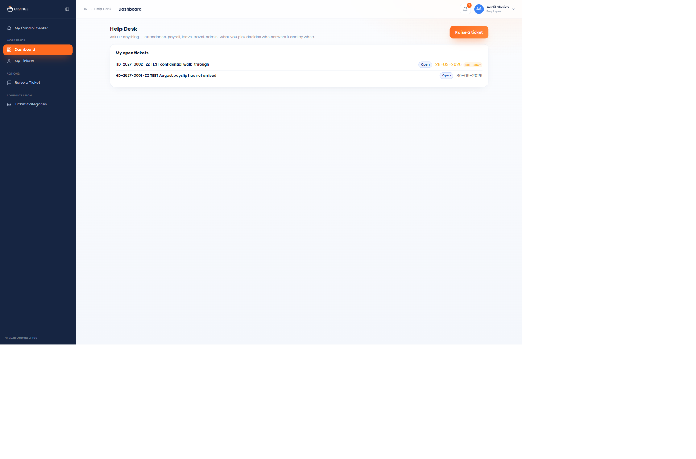

- [ ] The menu shows no HR-only screens
- [ ] "You have nothing open" appears when you have no tickets

---

**A2. Click "Raise a Ticket".**

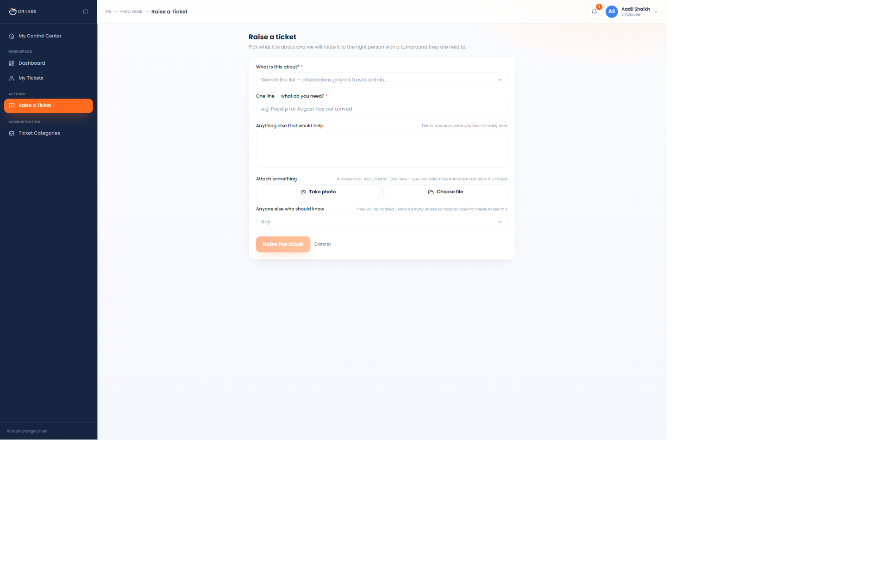

- [ ] The "Raise the ticket" button is greyed out until you fill the required fields

---

**A3. Open the category list.**
All 30 categories, searchable, each showing its turnaround underneath.

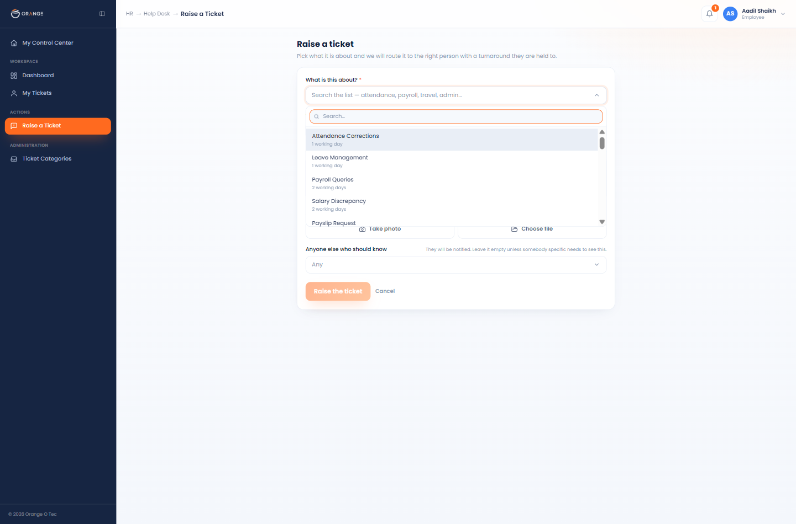

- [ ] Typing "pay" narrows the list
- [ ] Each category shows its turnaround

---

**A4. Pick "Payroll Queries".**
This is the most important check on the whole form.

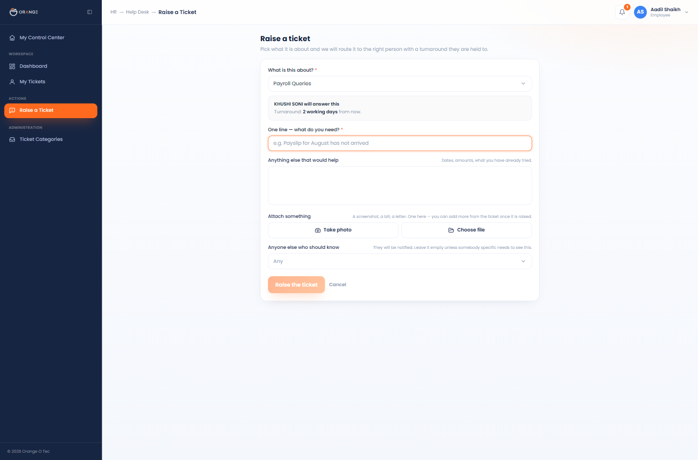

- [ ] It names the person who will answer: **"KHUSHI SONI will answer this"**
- [ ] It states the turnaround: **"2 working days from now"**
- [ ] Now try **"Full & Final Settlement"**: it should say *"As per Exit Policy, this one is
      governed by policy rather than a fixed number of days, so it will not show a due date"*
- [ ] Now try **"Sexual Harassment / POSH Complaint"**: a red **Confidential** badge appears and it
      warns that the rest of the HR team cannot read it
- [ ] Now try **"Travel Booking"**: it says the work is handled in Travel Desk
- [ ] Now try **"Others"**: an extra box appears that you *must* fill in

---

**A5. Fill it in and submit.**

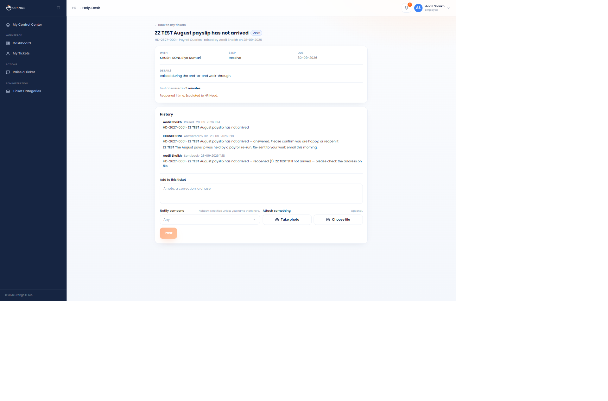

- [ ] You land on the ticket page with a number like **HD-2627-0001**
- [ ] It shows who it is with, which step, and the due date
- [ ] The history shows "Raised"
- [ ] There is a box at the foot to add a note, tag somebody or attach a file
- [ ] **Nobody is notified by a note unless you name them**, and the box says so

---

**A6. Check "My Tickets".**

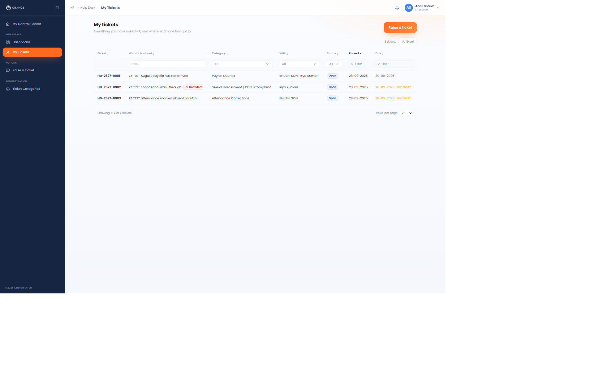

- [ ] Your ticket is listed
- [ ] Every column sorts, and has a filter underneath
- [ ] The Excel button downloads what you are looking at

---

### Part B. As the HR person who owns that category (Khushi)

**B1. Open Help Desk.**
The menu is much longer now: All Tickets, the queues, Control Center, Reports, Ticket Categories.

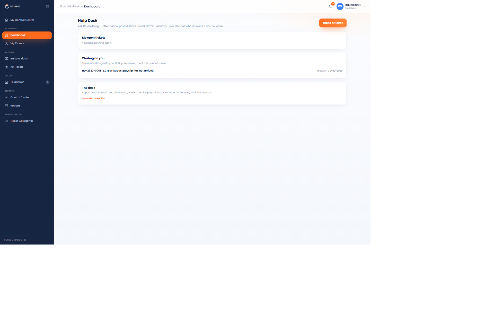

- [ ] "Waiting on you" lists the ticket just raised
- [ ] The queue in the sidebar shows a count badge

---

**B2. Open "To answer".**

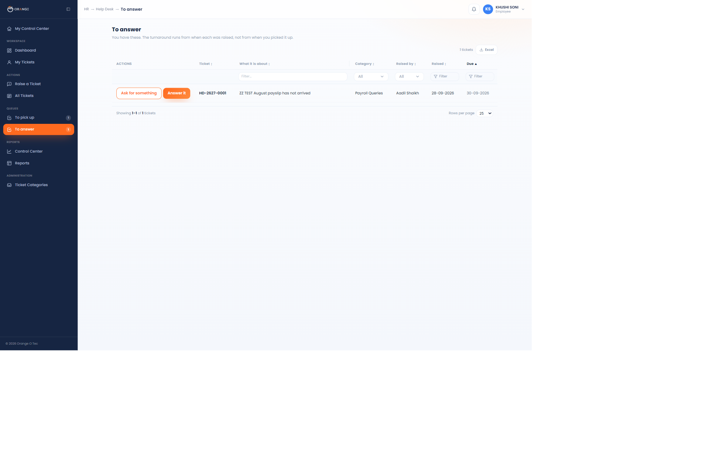

- [ ] The ticket is listed with its due date
- [ ] Two buttons on the row: **Ask for something** and **Answer it**
- [ ] Clicking a button opens the dialog and **stays on the queue**. It must not navigate away
- [ ] Clicking anywhere *else* on the row opens the ticket

---

**B3. Try "Ask for something".**

- [ ] You must name a person and write a real question. "More information" is refused
- [ ] After sending, the ticket **leaves your queue** and the employee sees "HR is waiting on you"
- [ ] Sign in as the employee, reply, and the ticket comes back to HR

---

**B4. Try "Answer it".**

- [ ] A blank answer is refused
- [ ] After sending, the ticket leaves your queue
- [ ] Open the ticket: it now says **"First answered in N minutes"**

---

**B5. Check "All Tickets" and the Control Center.**

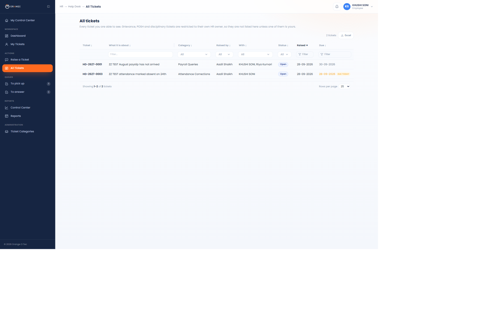
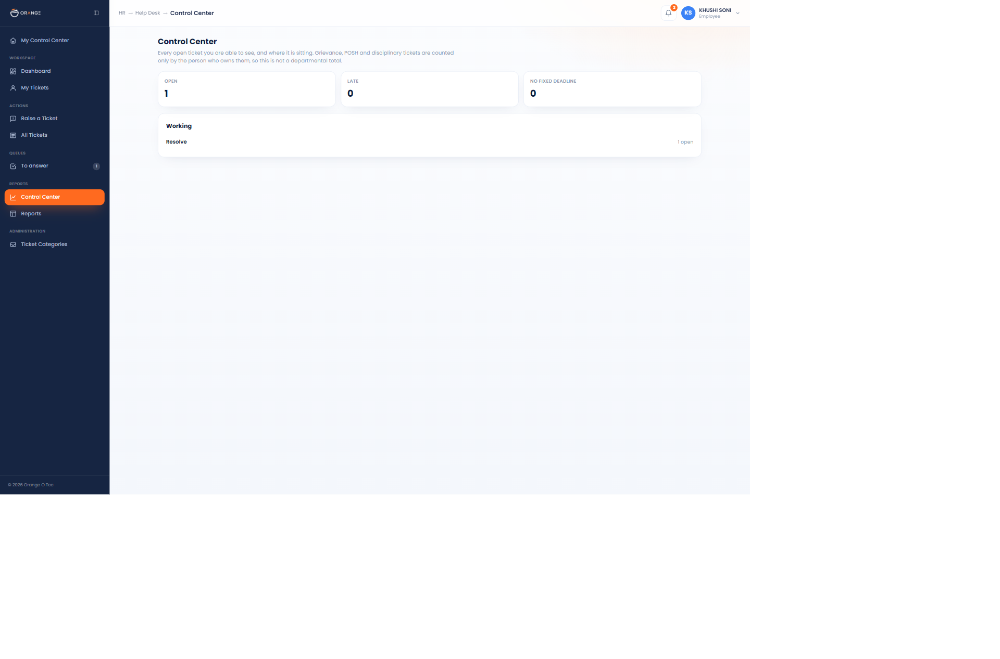

- [ ] The Control Center says *"open tickets you can see"*, not a department total
- [ ] "No fixed deadline" is its own tile, so untimed tickets are not counted as late

---

### Part C. Back as the employee: close it, or send it back

**C1. Open the answered ticket.** Two buttons: **That sorted it** and **It is still not right**.

- [ ] HR does **not** get these buttons. Only you do
- [ ] "That sorted it" asks how it was handled (Badly → Very well) and closes the ticket
- [ ] "It is still not right" **requires a reason**

---

**C2. Send it back, and read the warning first.**

- [ ] The dialog says who this will also be raised with, for example *"This will also be raised with
      Riya Kumari"*
- [ ] On a category whose escalation is only a label, it says so honestly: *"This is meant to go to
      Management, but nobody has been named for that yet, so HR will be told instead"*
- [ ] After sending: the ticket says **"Reopened 1 time. Escalated to HR Head"**, and the HR Head now
      appears under "With"

---

### Part D. The confidential test ⚠ the most important one

**D1. As an ordinary employee, raise a ticket under "Sexual Harassment / POSH Complaint".**

- [ ] The form warns you before you submit that only the HR owner can read it
- [ ] Note down the ticket number and the page address

**D2. Sign in as an HR person who does *not* own that category (Khushi).**

- [ ] Paste the ticket's address straight into the browser → **"That page does not exist"**
- [ ] It does **not** appear in All Tickets
- [ ] Its subject appears nowhere on any screen
- [ ] On the Reports page there is **no Confidential register section** for her

**D3. Sign in as the HR Head (Riya).**

- [ ] She can open the ticket and act on it
- [ ] The Reports page shows the **Confidential register** at the foot, with dates and status only,
      **not the complaint itself**

---

### Part E. The reports

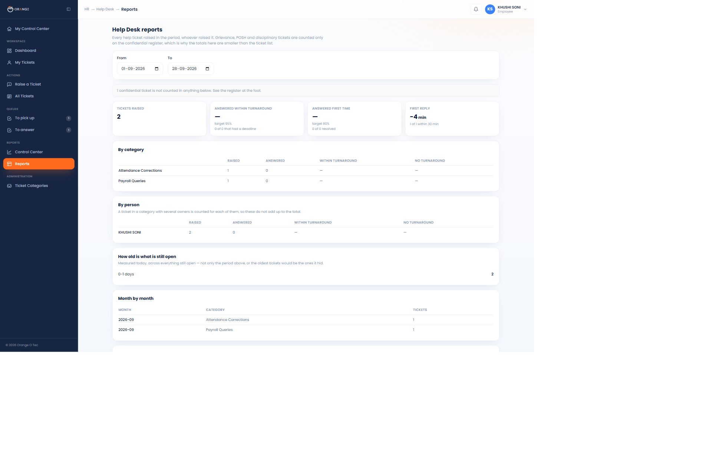

- [ ] The top line says how many confidential tickets were **left out** of the figures
- [ ] "Answered within turnaround" shows a **dash**, not 0%, when nothing had a deadline
- [ ] A line underneath says how many tickets had no fixed turnaround
- [ ] "Closed with no reply" is counted **separately** from "Closed by the employee"
- [ ] Change the date range at the top and the figures follow

---

### Part F. The categories (HR only)

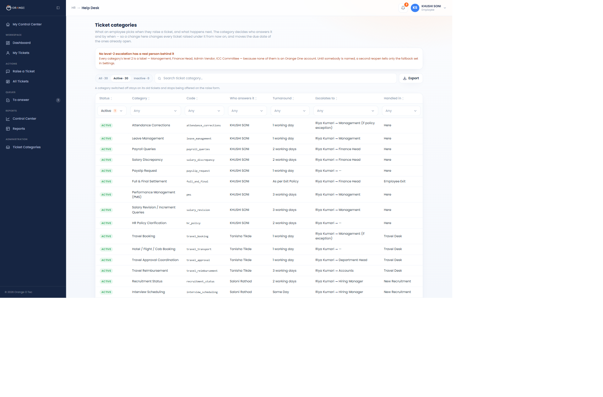

- [ ] A yellow banner warns that no level-2 escalation has a real person behind it
- [ ] Every column sorts and filters
- [ ] Editing a category lets you change the owner, turnaround and escalation
- [ ] The **Code** column cannot be edited, because the reports match on it
- [ ] The three confidential categories are marked and their confidentiality **cannot** be changed
- [ ] Clearing the turnaround makes it untimed, and the hint warns this moves the due date of every
      open ticket in that category

---

## 6. What is deliberately switched off

| Off | What it means today | To turn on |
|---|---|---|
| **Email** | People are told in the hub (the bell), not by email | Settings, plus a technical deploy |
| **Auto-close** | A ticket the employee never confirms stays open | Ask the developer to apply one file |
| **KPI scoring** | Help Desk does not yet count towards anyone's score | One switch, but read the note below first |

> **On KPI scoring:** the scorecard counts by *volume*, while Khushi's appraisal sheet puts the Help
> Desk at **5%** of her job. Two hundred tickets a month would dominate her score. It is off for that
> reason, and her sheet is written into the KRA/KPI lab where it is weighted the way HR wrote it.

---

## 7. Still owed by HR

1. **Real people for every level-2 escalation.** Management, Finance Head, Hiring Manager, Admin
   Vendor, Insurance Provider, Accounts, ICC Committee. None is an Orange One account.
2. **Who at Premware** the IT Support category escalates to.
3. **A decision to confirm:** the Help Desk sheet gives "Employee Engagement Activities" to Saloni,
   but Khushi's own appraisal claims that whole area at 25%. It is currently set to **Khushi**.
